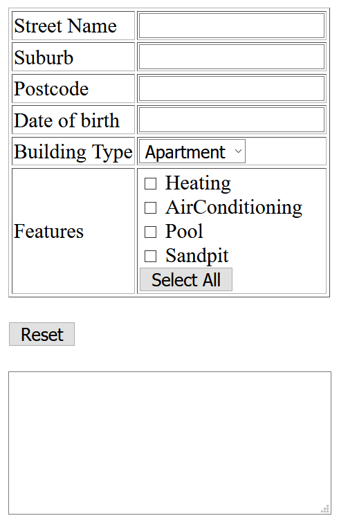

# Assessment 2 - FunForm

## Change Log

N/A

## Background & Motivation

This assessment aims to allow students to demonstrate knowledge they've developed during week 3 of the course. You will be building web pages with HTML, CSS, but predominately Javascript.

## Tasks

### Task 1 - Dynamic form

The page `task1/page.png` displays a series of inputs, and when valid, outputs a "summary" of this information in the textarea at the bottom of the page.

No CSS is required in this task. Please do not worry about styling your pages.

#### The page

Make a page `task1/index.html`.

The page consists of a:
 * Table
   * Text input for `Street` Name (must be between 3 and 50 characters).
   * Text input for `Suburb` (must be between 3 and 50 characters).
   * Text input for `Postcode` (must be a number that is exactly 4 digits).
   * Text input for `Date of birth` (valid input is the exactformat "DD/MM/YYYY" and must be a valid date. This means it must match the regex expression "[0-9]{2}/[0-9]{2}/[0-9]{4}" and when trying to parse it with the Javascript date object it does not return **NaN**).
   * Dropdown for `building type` (either "Apartment" or "House", no other options). Apartment is default.
   * Checkbox for `features` that the house has (Heating, AirConditioning, Pool, Sandpit).
   * Button to select / deselect all.
 * Remove button
 * Textarea (initially blank)

#### Actions

The following are events that trigger a render that should be binded to particular actions
* Changing of the "building type" or "features" should trigger a render.
* Blur of the "street name", "suburb", "postcode", or "date of birth" should trigger a render.

There are key buttons on the page:
* When the `Select All` button is clicked inside the features section, all 4 feature checkboxes are selected.
  * At any time when all 4 features are selected, the `Select All` button's text is changed to `Deselect all`. When this button is pressed in this state, all 4 of the feature checkboxes become unselected.
* When the `reset` button is clicked, the `textarea` has all of its text removed (i.e. it becomes blank again), and all of the form elements in the table are reset to their default state.

#### Rendering

The "output" refers to what the inner HTML text should be of the textarea at the bottom of the page.

* If they haven't inputted a `street name`, or the `street name` entered is invalid, the output should be _"Please input a valid street name"_
* If they have inputted a `street name`, but haven't inputted a `suburb` / the `suburb` is invalid, the output should be _"Please input a valid suburb"_
* If they have inputted a `street name` and `suburb`, but haven't inputted a `postcode` / the `postcode` is invalid, the output should be _"Please input a valid postcode"_
* If they have inputted a `street name`, `suburb`, and `postcode`, but haven't inputted a valid `date of birth`, the output should be _"Please enter a valid date of birth"_
* If they have entered the above correctly, the output is _"Your are [age (integer)] years old, and your address is [street name] St, [suburb], [postcode], Australia. Your building is [a|an] [building type], and it has [features]"_
  * If no features are selected, [features] is _"no features"_
  * If 1 feature is selected, [features] is just _"[feature1]"_
  * If 2 or more feature are selected, [features] is just _"[feature1], [feature2], and [feature3]"_ etc, where "and" joins the last and second last feature.

## Constraints & Assumptions

### Browser Compatibility

You should ensure that your programs have been tested on one of the following two browsers:
 * Locally, Google Chrome (various operating systems) latest version
 * On CSE machines, Chromium

### External libraries

You are restricted from using any third party CSS or JS libraries when completing this assessment. Basically, this means you can't import code using the `<script />` and `<link />` tags if it's from a file you did not write yourself, and you shouldn't be copying any larger chunks of code from other sources.

## Marking Criteria

Your assignment will be hand-marked by tutor(s) in the course according to the criteria below.

<table>
	<tr>
		<th>Criteria</th>
		<th>Weighting</th>
		<th>Description</th>
	</tr>
	<tr>
		<td>Visual Compliance</td>
		<td>50%</td>
		<td>
			<ul>
				<li>For specified tasks, JS events triggered by specific actions occur as specified</li>
			</ul>
		</td>
	</tr>
	<tr>
		<td>Code Quality</td>
		<td>50%</td>
		<td>
			<ul>
				<li>JS code is appropriately styled and formatted based on common conventions shown in lectures</li>
				<li>Ensure that source code (JS) is no more complicated or verbose than necessary to solve a given problem (less is more).</li>
			</ul>
		</td>
	</tr>
</table>

## Originality of Work

The work you submit must be your own work.  Submission of work partially or completely derived from
any other person or jointly written with any other person is not permitted.

The penalties for such an offence may include negative marks, automatic failure of the course and
possibly other academic discipline. Assignment submissions will be examined both automatically and
manually for such submissions.

Relevant scholarship authorities will be informed if students holding scholarships are involved in
an incident of plagiarism or other misconduct.

Do not provide or show your assignment work to any other person &mdash; apart from the teaching
staff of COMP6080.

If you knowingly provide or show your assignment work to another person for any reason, and work
derived from it is submitted, you may be penalized, even if the work was submitted without your
knowledge or consent.  This may apply even if your work is submitted by a third party unknown to
you.

Every time you make commits or pushes on this repository, you are acknowledging that the work you
submit is your own work (as described above).

Note you will not be penalized if your work has the potential to be taken without your consent or
knowledge.

## Submission

This assignment is due *Monday 6th of March, 10am*.

To submit your assignment, simply run the following command on a CSE terminal:

`$ 6080 submit ass2`

This will submit the latest commit on master as your submission.

It is your responsibiltiy to ensure that your code can be successfully demonstrated on the CSE machines (e.g. vlab)
from a fresh clone of your repository. Failure to ensure this may result in a loss of marks.

## Late Submission Policy

No late submission are accepted.
