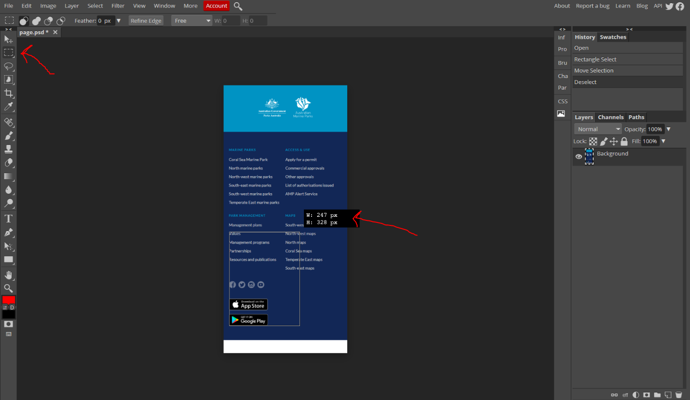

# Assessment 1 - PicToCode

## Change Log

N/A

## Background & Motivation

This assessment focuses on you implementing a series of basic web pages that look and behave like images and descriptions we we provide.

A basic capability required of someone working with user-facing interfaces is to be able to produce a web page that looks and behaves like something that has been clearly specified (e.g. an image). A common workflow within a product team may consist of a designer producing a high fidelity mock-up, which a developer will then take and use HTML/CSS to build the webpage for usage. In reality this process tends to be a bit more collaborative, and the high fidelity mockups provided are usually quite detailed and visually consist of many interact layers. However, for the sake of simplicity and fundamental knowledge we are providing flattened images with written requirements.

This assessment aims to allow students to demonstrate knowledge they've developed during week 1-3 of the course. You will be building web pages with HTML and CSS.

This assessment focuses on demonstrating skills with HTML ("Hyper Text Markup Language") and CSS ("Cascading Style Sheets") covered in week 1 of the course. Most of the tasks centre around this.

## Tasks

When we refer to "viewport width" below, we're referring to the size you can set your browser viewport at. You can learn more about how to do this [here](https://developer.chrome.com/docs/devtools/device-mode/).

### Task 1 - Static, fixed size page

Build a page that looks identical to `task1/page.PNG`. The window width you should work with is 1219 x 883 pixels. You 
are only allowed to use HTML and CSS for this task. No external libraries are permitted.

Please build your page in `task1/index.html`. You are welcome to create as many CSS files that you need in the `task1` folder for `index.html` to import. When being marked, your tutor will start with `index.html`.

#### Assets

* The assets are provided in `task1/assets/text.txt` give you the text to 
put on the page.
* Your font doesn't have to match exactly. You can use font-family `Arial` or `Helvetica` for the page.
* The living in Antarctic worksheet can link to the following: https://www.livescience.com/21677-antarctica-facts.html

### Task 2 - Static, fixed size page

Build a page that looks identical to `task2/page.PNG`. The window width you should work with is 420 x 699 pixels. You are 
only allowed to use HTML and CSS for this task. No external libraries are permitted.

Please build your page in `task2/index.html`. You are welcome to create as many CSS files that you need in the `task2` folder for `index.html` to import. When being marked, your tutor will start with `index.html`.

#### Assets
* There are no assets provided.

### Task 3 - Responsive static page

Build a responsive page that complies with `task3/page_big.PNG` and `task3/page_small.png`. The big page is 1894 x 1470 
pixels, and the small page is 419 x 3195 pixels. Your single page (note that you're not using two separate HTML files) should like identical to either of these pages depending on the window sized the browser is at.

Your are expected to have reasonable intermediate states. In other words, if the window size is some combination of widths between 1894 and 419, combined with some combination of heights between 1470 and 3195, the page should still reflect the same general structure.

Please build your page in `task3/index.html`. You are welcome to create as many CSS files that you need in the `task3` folder for `index.html` to import. When being marked, your tutor will start with `index.html`.

On top of this you are required to:
 * Ensure that the *UNSWROX* invite code component has a hover opacity of `0.7`.
 * When your mouse hovers over any of the 6 component boxes (which includes the image, header, and text) it should make the opacity of that entire component box (image, header, and text) `0.5`.
 * The emoji is 🙌

#### Assets
* Your font doesn't have to match exactly. YOu can use font-family `Arial` for the page.

## Analysing the pages

Two things will want to seek external help for are:
1) Determining the particular colour (RGB or HEX) of various pixels (we recommend the use of [a chrome extension](https://chrome.google.com/webstore/detail/eye-dropper/hmdcmlfkchdmnmnmheododdhjedfccka/), though other alternatives may be appropriate for you)
2) Determining the size of particular elements (we recommend the use of [photopea](https://www.photopea.com/)). An example of it's usage is below:

### Font Sizes

You will also be curious to know what the correct font-size and other font properties are for this assignment. Part of this assignment is trying to explore the relationship between how a font looks and the properties that are set for the element. Generally the best approach is to set a basic font size (e.g. `font-size: 20pt`), see how it looks, and if it just generally seems too big or too small, then adjust the `pt` value appropriately until you're comfortable with it. You will not be penalised for having font that is off by a few pixels in size. We will cover best practices when it comes to font sizing later in the course. 

## Constraints & Assumptions

### Browser Compatibility

You should ensure that your programs have been tested on one of the following two browsers:
 * Locally, Google Chrome (various operating systems) latest version
 * On CSE machines, Chromium

### External libraries

You are restricted from using any third party CSS libraries when completing this assessment. Basically, this means you can't import code using the `<script />` and `<link />` tags if it's from a file you did not write yourself, and you shouldn't be copying any larger chunks of code from other sources.

## Marking Criteria

Your assignment will be hand-marked by tutor(s) in the course according to the criteria below.

<table>
	<tr>
		<th>Criteria</th>
		<th>Weighting</th>
		<th>Description</th>
	</tr>
	<tr>
		<td>Visual Compliance</td>
		<td>50%</td>
		<td>
			<ul>
				<li>Rendered static HTML page accurately matches the reference image provided for each task</li>
				<li>For specified tasks, pseudo-class behaviour satisfies the task requirements</li>
				<li>For specified tasks, rendered HTML page renders appropriately for intermediate sizes</li>
			</ul>
		</td>
	</tr>
	<tr>
		<td>Code Quality</td>
		<td>50%</td>
		<td>
			<ul>
				<li>HTML is appropriately formatted such that each inner HTML is indented with respect to the outer one</li>
				<li>CSS is appropriate structured to be placed in external stylesheets rather than inline styles</li>
				<li>CSS ID and class selectors are clearly and meaningfully named</li>
				<li>CSS has limited repetition where multiple similar components use the same underlying styles</li>
				<li>Ensure that source code (HTML, CSS) is no more complicated or verbose than necessary to solve a given problem (less is more).</li>
				<li>Maintaining separation between HTML and CSS for structural and stylistic aspects, respectively</li>
				<li>Avoiding usage of more obselete methods of page styling that have been discussed in lectures (e.g. tables for non-tabular purposes)</li>
			</ul>
		</td>
	</tr>
</table>

## Originality of Work

The work you submit must be your own work.  Submission of work partially or completely derived from
any other person or jointly written with any other person is not permitted.

The penalties for such an offence may include negative marks, automatic failure of the course and
possibly other academic discipline. Assignment submissions will be examined both automatically and
manually for such submissions.

Relevant scholarship authorities will be informed if students holding scholarships are involved in
an incident of plagiarism or other misconduct.

Do not provide or show your assignment work to any other person &mdash; apart from the teaching
staff of COMP6080.

If you knowingly provide or show your assignment work to another person for any reason, and work
derived from it is submitted, you may be penalized, even if the work was submitted without your
knowledge or consent.  This may apply even if your work is submitted by a third party unknown to
you.

Every time you make commits or pushes on this repository, you are acknowledging that the work you
submit is your own work (as described above).

Note you will not be penalized if your work has the potential to be taken without your consent or
knowledge.

## Submission

This assignment is due *Monday 27th of February, 10am*.

To submit your assignment, simply run the following command on a CSE terminal:

`$ 6080 submit ass1`

This will submit the latest commit on master as your submission.

It is your responsibiltiy to ensure that your code can be successfully demonstrated on the CSE machines (e.g. vlab)
from a fresh clone of your repository. Failure to ensure this may result in a loss of marks.

## Late Submission Policy

No late submission are accepted.
